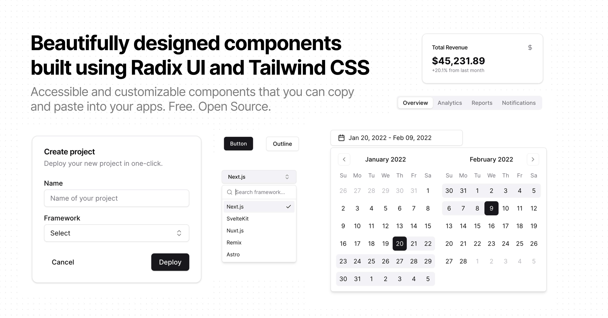

<p align="center"></p>

# @hanzo/ui

**The React component library for AI applications.** Accessible, customizable primitives for React, Vue, Svelte, and React Native — built on shadcn/ui, extended with AI, 3D, animation, and commerce components, and a single typed import surface.

<p align="center">
  <a href="https://www.npmjs.com/package/@hanzo/ui"></a>
  <a href="./LICENSE.md"></a>
  <a href="https://ui.hanzo.ai"></a>
</p>



## Features

- **161+ components** — 3x the surface of upstream shadcn/ui
- **Multi-framework** — React, Vue, Svelte, React Native
- **Two themes** — Default & New York variants
- **AI components** — chat, assistants, agent UI, playground
- **3D components** — interactive 3D elements
- **Animations** — advanced motion components
- **Page builder** — visual drag-and-drop assembly, export to TSX
- **Blocks** — 24+ production-ready full-page templates
- **White-label** — fork and rebrand by domain (Zoo, Lux, …)
- **Accessible** — built on Radix UI primitives
- **Customizable** — Tailwind CSS 4 (OKLCH), fully typed TypeScript

## Quick start

### Install

```bash
pnpm add @hanzo/ui
# or
npm install @hanzo/ui
```

### Use

```tsx
import { Button, Card, Input } from '@hanzo/ui'

export function App() {
  return (
    <Card>
      <Card.Header>
        <Card.Title>Welcome</Card.Title>
      </Card.Header>
      <Card.Content>
        <Input placeholder="Enter text..." />
      </Card.Content>
      <Card.Footer>
        <Button>Submit</Button>
      </Card.Footer>
    </Card>
  )
}
```

## One import surface (v8)

`@hanzo/ui@8` is the single entry point for the whole kit. Each capability is a
thin subpath that re-exports its home package — code lives once, and each home is
an optional peer, pulled only when you use its subpath.

| Import | What you get |
|---|---|
| `@hanzo/ui` · `/product` | charts, metrics, PageHeader, StatusTag, EmptyState, ComboBox, SlideOver, Toast |
| `@hanzo/ui/data` | RecordsView, DataTable, typed field editors |
| `@hanzo/ui/canvas` | ProjectCanvas, ServiceNode, DeployTimeline, EnvSwitcher |
| `@hanzo/ui/dashboard` | landing + deploy-pipeline + overview kit |
| `@hanzo/ui/usage` | UsageMeter, UsageProviderCard, UsageDashboard |
| `@hanzo/ui/gitops` | GitopsAppList, tree, diff, sync/rollback, HealthBadge |

Also available as granular imports:

```ts
import { Button, Card } from '@hanzo/ui/components'
import * as Dialog from '@hanzo/ui/primitives/dialog'
import { cn } from '@hanzo/ui/lib/utils'
```

## CLI

Add components straight into your project — the CLI copies source you own:

```bash
npx @hanzo/ui add button
npx @hanzo/ui add card dialog
```

Install from 35+ external registries too:

```bash
npx @hanzo/ui add @aceternity/spotlight
```

## Packages

The workspace publishes a family of scoped packages under `@hanzo/*`:

| Package | Purpose |
|---|---|
| `@hanzo/ui` | Core library + the v8 import surface (161+ components) |
| `@hanzo/react` | React primitives |
| `@hanzo/data` | Records, data tables, typed field editors |
| `@hanzo/canvas` | Service/deploy canvas components |
| `@hanzo/dashboard` | Dashboard + deploy-pipeline kit |
| `@hanzo/commerce` · `@hanzo/checkout` · `@hanzo/shop` | Commerce components |
| `@hanzo/agent-ui` | AI agent UI components |
| `@hanzo/brand` · `@hanzo/tokens` | Branding system & design tokens |
| `@hanzo/event` | Telemetry client (`POST /v1/event`) |

## Development

```bash
git clone https://github.com/hanzoai/ui.git
cd ui
pnpm install

pnpm build:registry   # generate the component registry FIRST
pnpm dev              # docs site + registry (http://localhost:3003)
```

> The registry generates the JSON the CLI reads, so `build:registry` must run
> before `build`. Keep the Default and New York themes in sync when adding
> components. Use pnpm — not npm or yarn.

```bash
pnpm build            # build the docs app
pnpm lint             # lint all workspaces
pnpm typecheck        # type check
pnpm test             # unit tests
pnpm test:e2e         # Playwright E2E
```

## Documentation

Full docs, live previews, and the component catalog: **[ui.hanzo.ai](https://ui.hanzo.ai)**.

## Contributing

See the [contributing guide](/CONTRIBUTING.md).

## License

MIT — see [LICENSE.md](./LICENSE.md).

---

## Hanzo — the Open AI Cloud

Open source · every language · on-chain settlement. [hanzo.ai](https://hanzo.ai) · [docs.hanzo.ai](https://docs.hanzo.ai)

**SDKs in every language** — [Python](https://github.com/hanzoai/python-sdk) (flagship) · [TypeScript](https://github.com/hanzo-js/sdk) · [Go](https://github.com/hanzo-go/sdk) · [Rust](https://github.com/hanzo-rs/sdk) · [C++](https://github.com/hanzo-cpp/sdk) · [Swift](https://github.com/hanzo-swift/sdk) · [Kotlin](https://github.com/hanzo-kt/sdk) · [umbrella](https://github.com/hanzoai/sdk)
