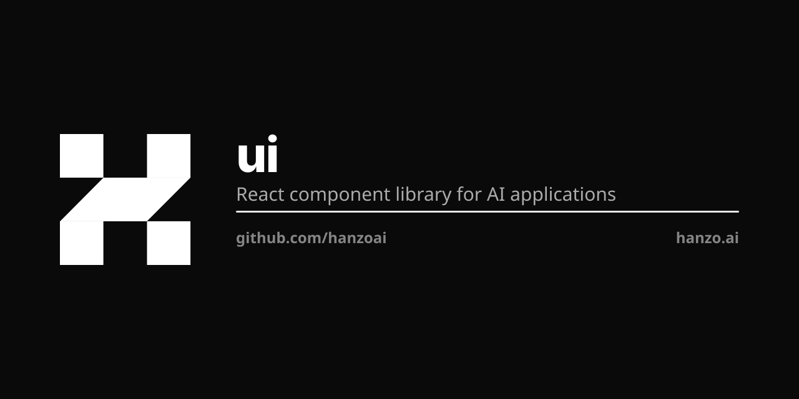

<p align="center"></p>

# @hanzo/ui

**The React component library for AI applications.** 157 components on one
substrate, so the same import runs on web, native and desktop.

<p align="center">
  <a href="https://www.npmjs.com/package/@hanzo/ui"></a>
  <a href="./LICENSE.md"></a>
  <a href="https://ui.hanzo.ai"></a>
</p>

## One substrate

Every component renders through [`@hanzo/gui`](https://github.com/hanzoai/gui)
primitives on the `@hanzo/tokens` scale. No Radix, no Tailwind, no utility
classes — style props and `$` tokens, which is what lets one import serve React,
React Native (Expo) and Tauri.

Other frameworks are their own packages, because a theme does not port:
[`@hanzo/svelte`](https://www.npmjs.com/package/@hanzo/svelte) for Svelte 5.

## Quick start

```bash
pnpm add @hanzo/ui
```

```tsx
import { Hanzo, Button, Card, CardHeader, CardTitle, CardContent, Input } from '@hanzo/ui'

export function App() {
  return (
    <Hanzo>
      <Card>
        <CardHeader><CardTitle>Welcome</CardTitle></CardHeader>
        <CardContent>
          <Input placeholder="Enter text…" />
          <Button>Submit</Button>
        </CardContent>
      </Card>
    </Hanzo>
  )
}
```

`<Hanzo>` is the whole setup — it carries the gui config, the theme and the
stylesheet. There is no CSS import and no generator step.

## Import surface

| Import | What you get |
|---|---|
| `@hanzo/ui` | the component surface — Button, Card\*, Dialog\*, Input, Select\*, Tabs\*, Popover\*, Command\*, … |
| `@hanzo/ui/product` | charts, metrics, PageHeader, StatusTag, EmptyState, ComboBox, SlideOver, Toast |
| `@hanzo/ui/chat` | Thread, Message, Composer, Sidebar, Header, Code, Sources |
| `@hanzo/ui/chat/pure` | `sends`, `ready`, `pinned` — decisions with no React, loads in Node |
| `@hanzo/ui/models` | ModelSelector, fetchModelCatalog |
| `@hanzo/ui/data` | RecordsView, DataTable, typed field editors |
| `@hanzo/ui/core` · `/tokens` | `cn`, font vars, the colour/theme/radii/spacing scale |
| `@hanzo/ui/theme.css` · `/styles.css` | tokens alone, or the complete sheet |
| `@hanzo/ui/primitives/<Name>` | one member, for hosts that modularize imports |
| `@hanzo/ui/{canvas,dashboard,usage,gitops}` | optional-peer kits |

## CLI

```bash
npx @hanzo/ui add button
npx @hanzo/ui add @aceternity/spotlight   # 35+ external registries
```

## Packages

| Package | Purpose |
|---|---|
| `@hanzo/ui` | the component library |
| `@hanzo/svelte` | the Svelte 5 kit |
| `@hanzo/react` | React primitives |
| `@hanzo/data` | records, data tables, typed field editors |
| `@hanzo/canvas` · `@hanzo/dashboard` | service/deploy canvas, dashboard kit |
| `@hanzo/commerce` · `@hanzo/checkout` · `@hanzo/shop` | commerce |
| `@hanzo/brand` · `@hanzo/tokens` | branding and design tokens |
| `@hanzo/event` | telemetry client (`POST /v1/event`) |

## Development

```bash
pnpm install
pnpm build:registry   # must run before the app
pnpm dev              # :3003
```

| Command | |
|---|---|
| `pnpm test` | unit |
| `pnpm test:consumer` | packs the tarball, installs it outside the repo, asserts computed styles |
| `pnpm typecheck` · `pnpm lint` | |

Docs at [ui.hanzo.ai](https://ui.hanzo.ai). MIT.
